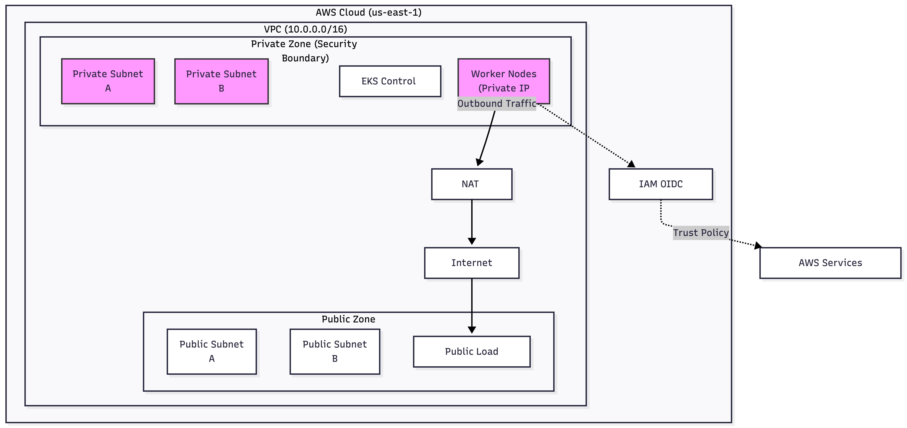

# Infrastructure EKS Provisioner 🚀


## 📖 Overview
This repository contains a **production-grade, modular Infrastructure-as-Code (IaC)** solution to provision an Amazon EKS cluster. It demonstrates strict security practices, network isolation, and reusable Terraform modules.

The project is designed to simulate a real-world enterprise environment where infrastructure state is isolated between environments (Dev, Prod) and security is enforced via **Least Privilege**.

**Key Features:**
* **Modular Architecture:** Separate, reusable modules for VPC, EKS, and IAM.
* **Network Security:** Worker nodes deployed in **Private Subnets** only; outbound traffic routed via NAT Gateway.
* **Least Privilege:** Implementation of **IRSA (IAM Roles for Service Accounts)** to map AWS permissions to specific Kubernetes Service Accounts, avoiding the use of broad node-level roles.
* **State Management:** Directory structure supports environment isolation (`dev`, `prod`).

## 🏗 Architecture



The infrastructure stack consists of three core layers:

1.  **VPC Module (Networking):**
    * Creates a custom VPC with isolated Public and Private subnets.
    * Configures **NAT Gateways** for secure outbound traffic.
    * Applies specific tags (`kubernetes.io/role/elb`, etc.) required by the AWS Load Balancer Controller.
2.  **EKS Module (Compute):**
    * Provisions the EKS Control Plane and Managed Node Groups.
    * Strictly places worker nodes in private subnets.
    * Enables the **OIDC Provider** to support IRSA.
3.  **IAM Module (Security):**
    * Generates IRSA-compatible roles that trust the OIDC provider.
    * Allows fine-grained permission scoping (e.g., S3 Read Access) to specific Pods.

## 📂 Directory Structure

```text
infrastructure-eks-provisioner/
├── modules/               # Reusable Terraform Logic
│   ├── vpc/               # Network Topology (Subnets, NAT, IGW)
│   ├── eks/               # Cluster Control Plane & Node Groups
│   └── iam/               # IRSA & Security Policies
├── environments/          # State Isolation
│   └── dev/               # Development Env Implementation
└── README.md              # Project Documentation
```

## 🚀 Quick Start

### Prerequisites
* **Terraform** v1.0+
* **AWS CLI** configured with appropriate credentials
* **kubectl** installed

### Deployment Guide

1. **Clone the Repository**
```bash
git clone [https://github.com/abhisheksingh22se/infrastructure-eks-terraform-provisioner.git](https://github.com/abhisheksingh22se/infrastructure-eks-terraform-provisioner)
cd infrastructure-eks-terraform-provisioner
```

2. **Initialize the Module** 
Navigate to the environment you wish (e.g. dev)
```bash
cd environment/dev
terroform init
```

3. **Review the Plan** 
Generate an execution plan to verify the resources to be created.
```bash
terraform plan
```

4. **Apply Infrastructure** 
Provision the resources on AWS (Note: It usually takes ~15-20 minutes).
```bash
terraform apply
```

5. **Connect to Cluster**
Once finished, Terraform will output the command to update your kubeconfig. Run it:
```bash
aws eks update-kubeconfig --region us-east-1 --name eks-infra-cluster
```

6. **Verify Access**
```bash
kubectl get nodes
```

## 🔒 Security Highlights

* **OIDC Integration:** The cluster is explicitly configured with an OIDC provider to support IAM Roles for Service Accounts (IRSA).
* **No Public Nodes:** All worker nodes are strictly placed in private subnets with no public IP addresses.
* **Encrypted State:** (Recommended) The backend configuration supports S3/DynamoDB for encrypted, locked state management.
* **Tagged Subnets:** Internal Load Balancers are forced into private subnets via `kubernetes.io/role/internal-elb` tags.

## 👤 Author

**Abhishek Singh**
*DevOps Engineer | Cloud Infrastructure Specialist*

[LinkedIn](https://linkedin.com/in/abhisheksingh22sep) | [GitHub](https://github.com/abhisheksingh22se)